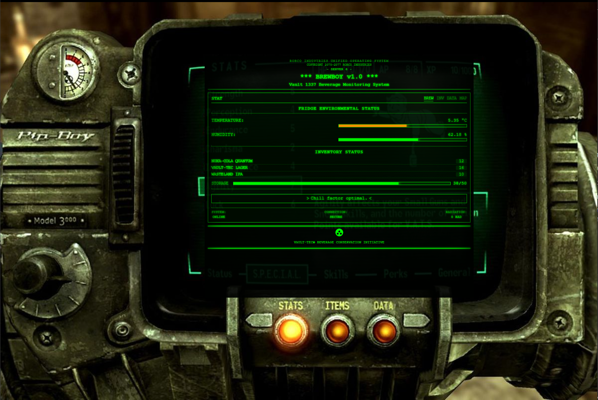

# BrewBoy v1.0  

A Fallout/Pip-Boy themed Flask web application that monitors your fridge temperature and humidity using Home Assistant sensors.

## Features

- Displays fridge temperature and humidity from Home Assistant sensors
- Styled like a Pip-Boy from the Fallout video game series
- Shows status warnings when temperature exceeds 6°C
- Auto-refreshes every 30 seconds
- Retro CRT and scanline effects
- Pip-Boy image frame for authentic Fallout look

## Requirements

- Python 3.9+
- Flask
- requests
- python-dotenv
- Home Assistant instance with temperature and humidity sensors
- A Pip-Boy image (pip-boy.jpg) placed in the static/images directory

## Setup Instructions

1. Clone this repository:
   ```
   git clone https://github.com/DanDon01/brewboy.git
   cd brewboy
   ```

2. Install dependencies:
   ```
   pip install -r requirements.txt
   ```

3. Configure your Home Assistant connection:
   - Create a `.env` file and update with your Home Assistant URL and long-lived access token:
     ```
     HA_URL=http://homeassistant.local:8123
     HA_TOKEN=your_long_lived_access_token
     ```
   
   To generate a long-lived access token in Home Assistant:
   1. Go to your profile in Home Assistant (click on your username in the sidebar)
   2. Scroll down to "Long-Lived Access Tokens"
   3. Click "Create Token"
   4. Give it a name (e.g., "BrewBoy")
   5. Copy the token and paste it in the `.env` file

4. Ensure your Home Assistant has the following sensors (or update the `TEMP_SENSOR_ID` and `HUMIDITY_SENSOR_ID` variables in `app.py` with your sensor entity IDs):
   - `sensor.0x00124b0023c38740_temperature` (temperature sensor)
   - `sensor.0x00124b0023c38740_humidity` (humidity sensor)

5. Add a Pip-Boy image:
   - Place a Pip-Boy image named `pip-boy.jpg` in the `static/images` directory
   - You may need to adjust the CSS in `static/css/styles.css` to position the interface correctly within your specific image

## Running the Application

Run the Flask app:
```
python app.py
```

Open your browser and navigate to `http://localhost:5000`

## Deploying as a Service

For a production deployment, consider setting up BrewBoy as a systemd service or using a production WSGI server like Gunicorn.

### Example systemd service configuration:

```ini
[Unit]
Description=BrewBoy Service
After=network.target

[Service]
User=yourusername
WorkingDirectory=/path/to/brewboy
ExecStart=/path/to/python /path/to/brewboy/app.py
Restart=always

[Install]
WantedBy=multi-user.target
```

## Screenshots



## Credits

Created for monitoring your precious beverages in the post-apocalyptic wasteland (or just your kitchen).

## License

MIT 